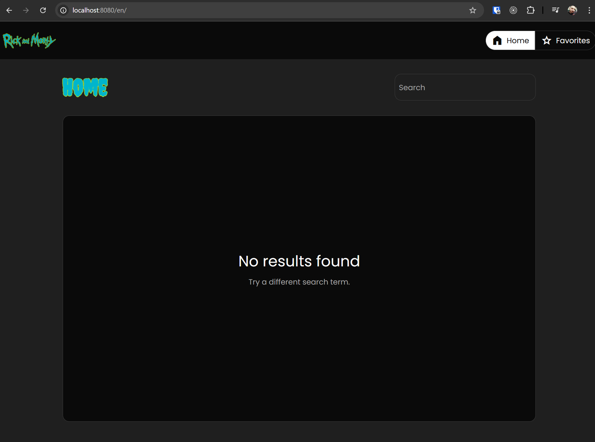
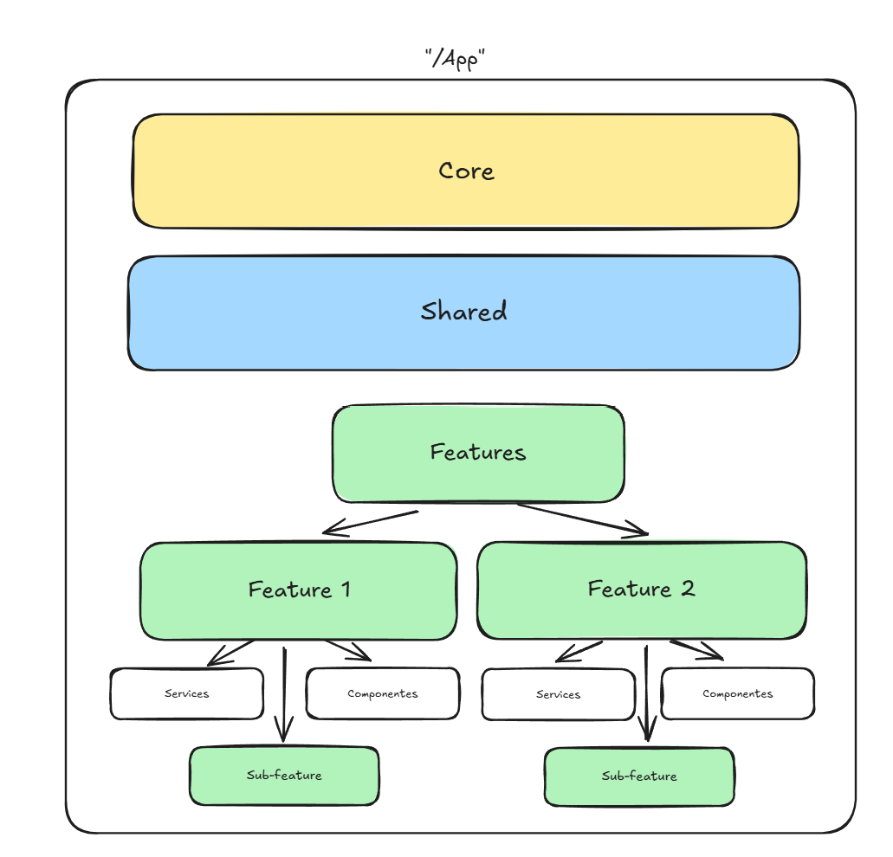

# Ricky and Morty API Wrapper

Projeto com a implementação de uma interface com Angular utilizando a [API do Ricky and Morty](https://rickandmortyapi.com/documentation/#introduction).

[Live](https://ricky-and-morty-api-wrapper.vercel.app)


## Rodando o projeto localmente

## Pre-requisitos:

- **Git** e **Node.js** ou **Docker**

Para executar o projeto há duas formas:

### Git Clone:

```
git clone https://github.com/mbarbosasan/ricky-and-morty-api-wrapper
```

Na raiz do projeto:

```
pnpm i
pnpm run start
```

Acesse `http://localhost:4200` e a aplicação estará disponível.

> [!NOTE]  
> Caso não tenha o pnpm pode ser utilizado o npm normal, os comandos são os mesmos.

### Docker

```
docker pull mbarbosas/ricky-and-morty-api-wrapper

docker run -p 8080:8080 mbarbosas/ricky-and-morty-api-wrapper
```

Acesse `http://localhost:8080` e a aplicação estará disponível.

## Introdução

Abaixo algumas explicações sobre como foi feito a implementação.

### i18n

A internacionalização da aplicação está disponível apenas através da imagem Docker devido a necessidades das configurações no NGINX, tentei pesquisar sobre como poderia configurar na Vercel
mas não consegui encontrar nada parecido com os blocos de location do NGINX, abaixo como executar:

#### Docker
```
docker pull mbarbosas/ricky-and-morty-api-wrapper

docker run -p 8080:8080 mbarbosas/ricky-and-morty-api-wrapper
```

Atualmente só existe a versão "pt-BR" que é a padrão e a "en", para visitá-la basta alterar na URL para `http://localhost:8080/en`;

#### Localmente
```
git clone https://github.com/mbarbosasan/ricky-and-morty-api-wrapper

# As configurações de i18n estão separadas na branch ou acabaria quebrando a versão da Vercel.
git checkout i18n

pnpm i

# Para visualizar no locale em inglês.
ng serve --configuration=en
```



### Estrutura

O projeto está estruturado da forma como normalmente eu desenvolvo aplicações, seguindo as recomendações do Style Guide do Angular.

**Core**: Se refere a dependências ou códigos que fazem parte do contexto "global" da aplicação, como por ex: Interceptors, Guards etc. Nesse caso em específico contém apenas um Interceptor e o Layout base da aplicação que eu considero como "Core".

**Shared**: Essencialmente dependências que não fazem parte do "core" da aplicação e que podem ser utilizada por diversos "módulos/features" ao mesmo tempo, Ex: "blocos" de UI, Services.

**Features**: Considero como feature qualquer parte da aplicação que tem seu próprio contexto e requisitos, sendo especificamente nesse caso a parte de "Início" e "Favoritos".

E por último mas não menos importante, cada "feature" tem suas próprias camadas: Services, Models/Types, Components e etc.



### Reatividade

A implementação foi feita pensada para ser completamente reativa, utilizando exaustivamente do RxJS e convertendo-os para Signal através do [toSignal](https://angular.dev/api/core/rxjs-interop/toSignal) quando estiverem sendo utilizados na UI, dessa forma podemos alterar o ChangeDetection de todos os componentes para OnPush e ter um ganho considerável de performance.

Pessoalmente eu entendo que desenvolvendo dessa forma o código se torna mais fácil de manter e realizar a composição e também por acabar me "forçando" a escrever código declarativo ao invés de estruturado.

- **NgRX**

Eu preferi optar por não usar nenhuma biblioteca externa de gestão de estado por achar que não havia necessidade, acabaria escrevendo muito pra fazer pouco uma vez que o único estado global da aplicação é os "Favoritos" e por isso optei por fazer esse controle apenas com Subjects do RxJS.
